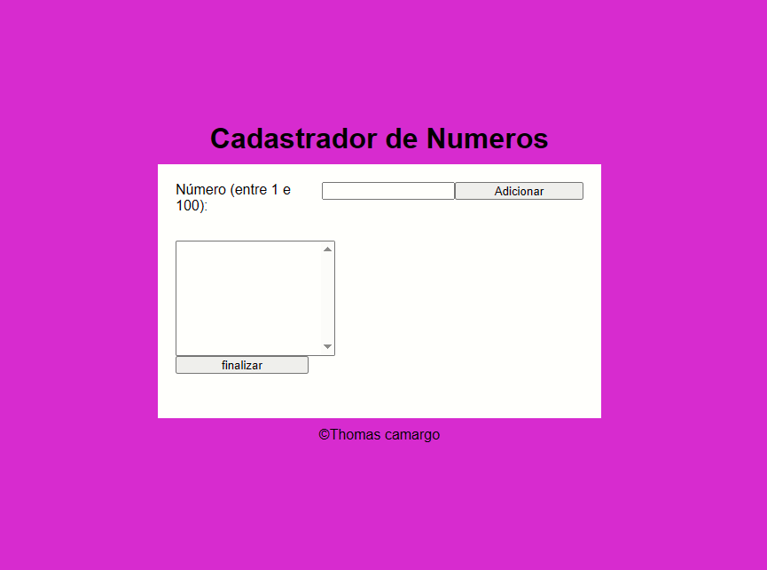

# 🔢 Cadastrador de Números

📌 Um projeto simples e funcional desenvolvido em JavaScript para praticar lógica de programação e manipulação do DOM.

---

## 🚀 Demonstração



---

## 💡 Sobre o projeto

O **Cadastrador de Números** permite ao usuário inserir números entre **1 e 100**, evitando duplicações e exibindo informações ao final.

Este projeto foi desenvolvido com foco em:

* Prática de lógica com arrays
* Validação de dados
* Manipulação do DOM com JavaScript

---

## ⚙️ Funcionalidades

* ✅ Adicionar números entre 1 e 100
* 🚫 Bloquear números duplicados
* 📋 Exibir lista de números cadastrados
* 📊 Mostrar:

  * Maior número
  * Menor número
  * Soma total
  * Média dos valores

---

## 🛠️ Tecnologias utilizadas

* HTML5
* CSS3
* JavaScript

---

## 🧠 Aprendizados

Com esse projeto, eu aprendi:

* Como validar entradas do usuário
* Trabalhar com arrays (`push`, `indexOf`)
* Criar lógica para cálculos (soma, média, etc.)
* Manipular elementos da tela dinamicamente

---

## 📂 Como executar o projeto

1. Clone o repositório:

```bash
git clone https://github.com/seu-usuario/seu-repo.git
```

2. Abra o arquivo `index.html` no navegador

---

## 📌 Melhorias futuras

* 🎨 Melhorar o design com CSS moderno ou Tailwind
* ⚛️ Migrar para React
* 💾 Salvar dados no LocalStorage
* 📱 Tornar totalmente responsivo

---

## 📫 Contato

* 💼 LinkedIn: https://www.linkedin.com/in/thomas-camargo-6981743b7/
* 🐙 GitHub: https://github.com/thomascamargo2024
* 📧 Email: [thomacamargo@gmail.com](mailto:thomacamargo@gmail.com)

---

⭐ *Projeto desenvolvido para evolução contínua na programação.*
